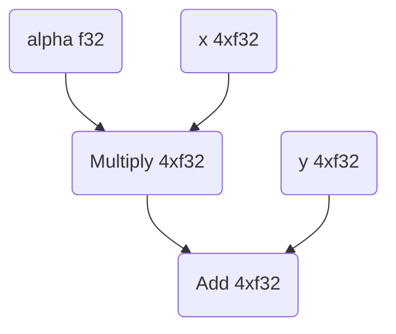

## Getting started - basic example

The following code sample shows how to use XLA to compute a simple vector
expression: $$\alpha x+y$$ ("axpy"). The full code sample is [here](TODO).

This sample presents an example XLA program using [MLIR](https://mlir.llvm.org/)
and [StableHLO](https://github.com/openxla/stablehlo) that takes data as input,
uses XLA to build a graph to compute the expression and returns the resulting
data.

This is done in several steps:

1.  Construct an XLA graph that encodes the expression we want to compute. The
    graph's nodes are XLA operations (sometimes called "ops" or HLOs for
    "high-level operations"), and its edges represent the data flow between
    operations. We will create this graph using a
    [StableHLO](https://github.com/openxla/stablehlo) module.
2.  Ask XLA to create a "computation" based on this graph. In our example, we
    will use the `xla_compile` utility to transform our computation to an
    executable and save it to disk.
3.  Use the previously compiled executable and input data to compute results.

The XLA graph we construct for axpy is:



Here is the StableHLO module that XLA will use to construct our graph (step 1):

```mlir
module @axpy {
  func.func public @main(
    %alpha: tensor<f32>,
    %x: tensor<4 x f32>,
    %y: tensor<4 x f32>
  ) -> tensor<4 x f32> {
    %a = "stablehlo.broadcast_in_dim" (%alpha) {
      broadcast_dimensions = dense<[]> : tensor<0 x i64>
    } : (tensor<f32>) -> tensor<4 x f32>
    %ax = stablehlo.multiply %a, %x : tensor<4 x f32>
    %result = stablehlo.add %ax, %y : tensor<4 x f32>
    return %result: tensor<4 x f32>
  }
}
```

In this example, all shapes are statically determined, but StableHLO supports
both bounded and unbounded dynamism.

Notably, StableHLO doesn't support implict broadcasting, so we will use
`"stablehlo.broadcast_in_dim"` to broadcast our scalar to a rank-1 tensor.

We will use a Bazel macro that will invoke the `xla_compile` utility for us
(step 2):

```bazel
xla_aot_compile_cpu(
    name = "stablehlo_axpy_executable",
    module = "stablehlo_axpy.mlir",
)
```

Then we can load the executable from disk:

```c++
std::string path = tsl::io::JoinPath(tsl::testing::XlaSrcRoot(), "examples",
                                     "axpy", "stablehlo_axpy_executable");
std::string serialized_aot_result;
TF_ASSERT_OK(
    tsl::ReadFileToString(tsl::Env::Default(), path, &serialized_aot_result));

// Get a LocalClient which will allow us to run LocalExecutables. In this
// example, we will execute on the CPU (aka Host) platform.
TF_ASSERT_OK_AND_ASSIGN(se::Platform * platform,
                        PlatformUtil::GetPlatform("Host"));
if (platform->VisibleDeviceCount() <= 0) {
  EXPECT_TRUE(false) << "CPU platform has no visible devices.";
}
LocalClientOptions local_client_options;
local_client_options.set_platform(platform);
TF_ASSERT_OK_AND_ASSIGN(
    LocalClient * client,
    ClientLibrary::GetOrCreateLocalClient(local_client_options));

// Load from AOT result.
ExecutableBuildOptions executable_build_options;
TF_ASSERT_OK_AND_ASSIGN(
    std::unique_ptr<LocalExecutable> local_executable,
    client->Load(serialized_aot_result, executable_build_options));
```

And finally we can feed the executable some inputs (step 3):

```c++
// Create inputs to our computation.
auto alpha_literal = xla::LiteralUtil::CreateR0<float>(3.14f);
auto x_literal = xla::LiteralUtil::CreateR1<float>({1.0f, 2.0f, 3.0f, 4.0f});
auto y_literal =
    xla::LiteralUtil::CreateR1<float>({10.5f, 20.5f, 30.5f, 40.5f});

// ScopedShapedBuffer takes an already allocated buffer and deallocates
// on destruction. If using a non-host device, this corresponds to device
// memory.
TF_ASSERT_OK_AND_ASSIGN(ScopedShapedBuffer alpha,
                        client->LiteralToShapedBuffer(
                            alpha_literal, client->default_device_ordinal()));
TF_ASSERT_OK_AND_ASSIGN(ScopedShapedBuffer x,
                        client->LiteralToShapedBuffer(
                            x_literal, client->default_device_ordinal()));
TF_ASSERT_OK_AND_ASSIGN(ScopedShapedBuffer y,
                        client->LiteralToShapedBuffer(
                            y_literal, client->default_device_ordinal()));
ExecutableRunOptions executable_run_options;
executable_run_options.set_allocator(client->backend().memory_allocator());

// Do the computation.
TF_ASSERT_OK_AND_ASSIGN(
    ScopedShapedBuffer axpy_result,
    local_executable->Run({&alpha, &x, &y}, executable_run_options));

// Convert back to Literal and check that the result is what we expect.
TF_ASSERT_OK_AND_ASSIGN(Literal axpy_result_literal,
                        client->ShapedBufferToLiteral(axpy_result));
xla::LiteralTestUtil::ExpectR1Near<float>({13.64f, 26.78f, 39.92f, 53.06f},
                                          axpy_result_literal,
                                          xla::ErrorSpec(0.01f));
```

Sample output from our test should look like this:

```sh
$ bazel test examples/axpy:stablehlo_aot_compile_test
[==========] Running 1 test from 1 test suite.
[----------] Global test environment set-up.
[----------] 1 test from XlaCompileTest
[ RUN      ] StableHloAxpyTest.LoadAndRunCpuExecutable
[       OK ] StableHloAxpyTest.LoadAndRunCpuExecutable (95 ms)
[----------] 1 test from StableHloAxpyTest (95 ms total)
[----------] Global test environment tear-down
[==========] 1 test from 1 test suite ran. (95 ms total)
[  PASSED  ] 1 test.
```
